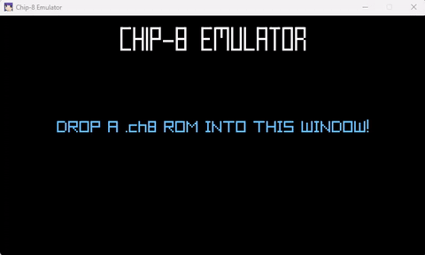

# chippy

Chip-8 Emulator written in C  
Uses [raylib](https://github.com/raysan5/raylib) for graphics, key presses, and audio  
Binary compiled with Visual Studio 2022  

To build with CMake:
1. Install raylib
2. Run: ``cmake -B build``
3. Run: ``cmake --build build``  

---
### License

This game sources are licensed under an unmodified zlib/libpng license, which is an OSI-certified, BSD-like license that allows static linking with closed source software. Check [LICENSE](LICENSE) for further details.

*Copyright (c) 2023 Danny Huynh (akadroid)*
